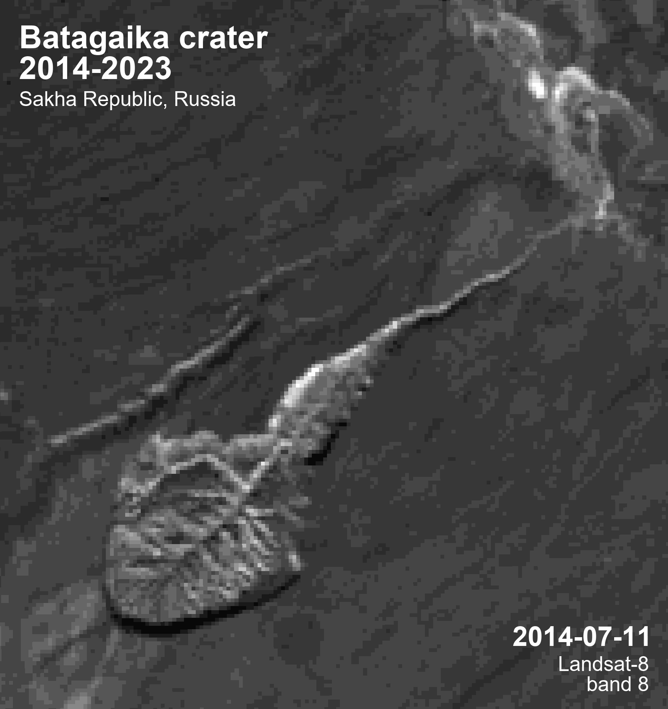

# Expansion of the Batagaika crater in 2014-2023



With other frames speed: [100ms](./gifs/batagika_crater_2014-2023_100ms.gif) |
[500ms](./gifs/batagika_crater_2014-2023_500ms.gif) |
[1000ms](./gifs/batagika_crater_2014-2023_1000ms.gif)

## Introduction

In the last few years, due to the global increase in earth's temperature, there has been an expansion of the largest thermokar depression - the world's largest permafrost crater [Batagaika](https://goo.gl/maps/YDCDqi5Qcz4pCJbm9) (Sakha Republic, Russia).

The project was created for the purpose of monitoring and analyzing crater changes using various GIS and visualization tools.

[More about Batagaika crater](https://en.wikipedia.org/wiki/Batagaika_crater)

## Workflow

To create the above gif, which shows the rate of crater expansion over the given period, the following steps were completed:

> 1. Search for images of the necessary territory in a resolution acceptable for monitoring.
>
> 2. Selection of the most suitable bands from [multispectral images](https://en.wikipedia.org/wiki/Multispectral_imaging) of the Earth.
>
> 3. Processing and [atmospheric correction](https://semiautomaticclassificationmanual.readthedocs.io/en/latest/remote_sensing.html#dos1-correction) of the received images.
>
> 4. Creating the necessary gif frames with dynamic labels.
>
> 5. Combining frames into GIF format with different playback speeds.

### Step 1. Image search

The source of the images was data from the [Sentinel-2](https://sentinel.esa.int/web/sentinel/missions/sentinel-2) space program and the [Landsat-8](https://landsat.gsfc.nasa.gov/satellites/landsat-8/) satellite. The data was uploaded to [QGIS](https://www.qgis.org/en/site/) using [EarthExplorer](https://earthexplorer.usgs.gov/) from the [United States Geological Survey](https://www.usgs.gov/) via the [Semi-Automatic Classification Plugin (SCP)](https://github.com/semiautomaticgit/SemiAutomaticClassificationPlugin).

When searching for images, there were problems with downloading Sentinel-2 data after 2019, which is why we had to use lower-resolution Landsat-8 images

### Step 2. Bands selection

Out of the many multispectral image bands provided, panchromatic bands number 8 with the highest resolution of all were selected:
> - 10 meters for Sentinel-2  
> 
> - 15 meters for Landsat-8   
> 

### Step 3. Processing

The next step was to crop all the selected images within the territory of the crater, for the convenience of further work and saving memory. Previously, atmospheric correction was carried out using SCP.


### Step 4. Frames preparation

Due to the fact that in the future the number of images and the images themselves can change and be supplemented, it was decided to create gifs and make inscriptions on their frames using [Python](https://www.python.org/), specifically the [Pillow](https://pypi.org/project/Pillow/) image processing library.

Function for creating inscriptions:

```py
from PIL import Image, ImageFont, ImageDraw

def draw_inscription(
    image,
    font_path,
    font_size,
    font_fill,
    text_align,
    text_pos,
    text
):
    img = image
    font = ImageFont.truetype(font_path, font_size)
    drawer = ImageDraw.Draw(img)
    drawer.text((text_pos), text, font=font, fill=font_fill, align=text_align)
```
Examples of creating various inscriptions:

```py
# the usual inscription
draw_inscription(image, 'fonts/ARIALBD.TTF', 84, 'white', 'left', (50, 50), 'Batagaika crater\n2014-2023')
# an inscription displaying the date of the frame
draw_inscription(image, 'fonts/ARIALBD.TTF', 72, 'white', 'right', (1351, 1634), f'{image_path[:-4]}')
# the inscription with the condition
draw_inscription(image, 'fonts/ARIAL.TTF', 54, 'white', 'right', (1471, 1717),
                 f'{"Landsat-8" if int(image_path[:4]) < 2019 else "Sentinel-2"}\nband 8')
```
In particular, it was necessary to make a small crop of images after exporting from QGIS:

```py
import os
from PIL import Image

image_paths = os.listdir('images')

for image in image_paths:
    # to find out the size of the image: print(img.size)
    img = Image.open(f'images/{image}')
    img_crop = img.crop((0, 0, 1761, 1866))
    img_crop.save(f'images/{image}')
```

After you have decided on the labels, you need to create frames, followed by their transfer to the gif creation function:

```py
def create_frames(out_path):
    for image_path in image_paths:
        image = Image.open('images/' + image_path)
        draw_inscription(...)
        draw_inscription(...)
        draw_inscription(...)
        draw_inscription(...)
        image.save(f'{out_path}frame_{image_path}')
    frames_list = os.listdir('frames')
    return frames_list
```

### Step 5. Creating gif

Finally, it remains to combine the previously obtained frames with inscriptions in GIF format!

```py
def create_gif(file_out, frames, duration, loop):
    frames = [Image.open(f'frames/{frame}') for frame in os.listdir('frames')]
    frames[0].save(
        file_out,
        save_all=True,
        append_images=frames[1:],
        optimize=True,
        duration=duration,
        loop=loop
    )
```
> **Note**  
> duration 1000 = 1 FPS

That's it! Now, when creating new gifs, you do not need to manually edit each frame and make inscriptions, it will be enough to enter a few lines of code.